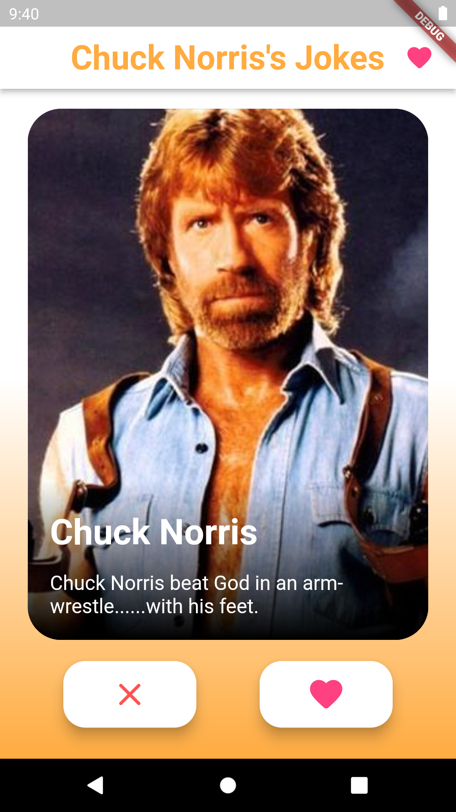
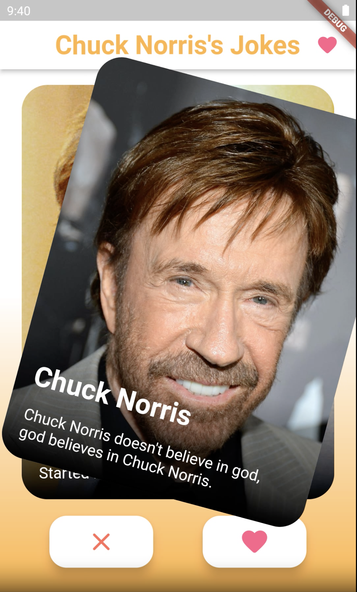
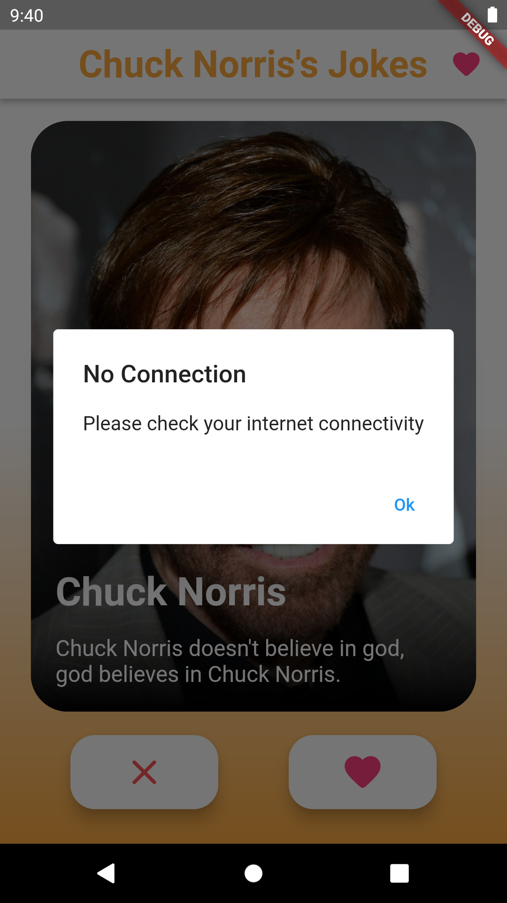
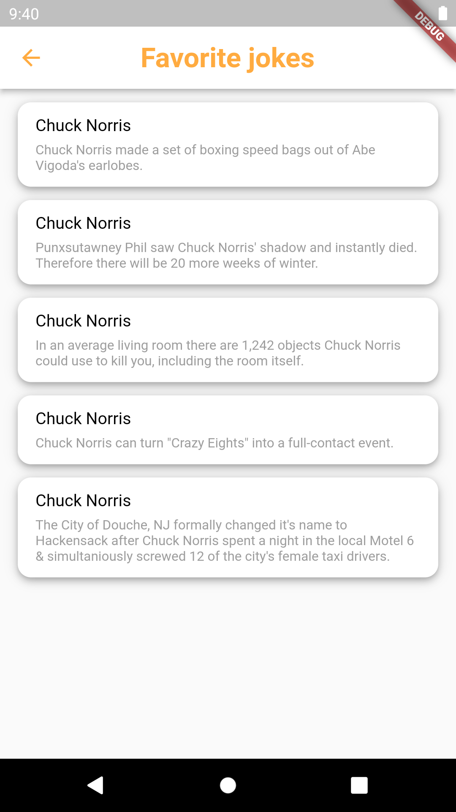
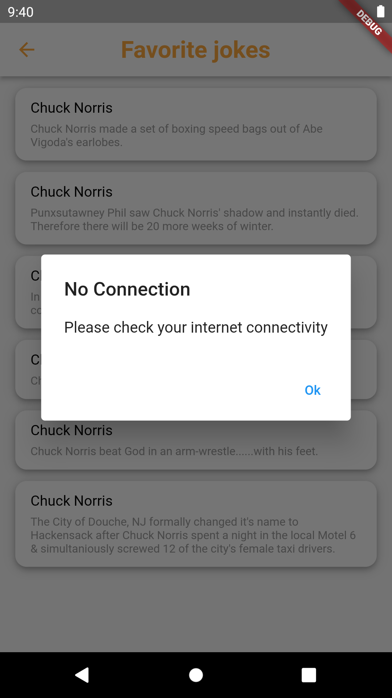
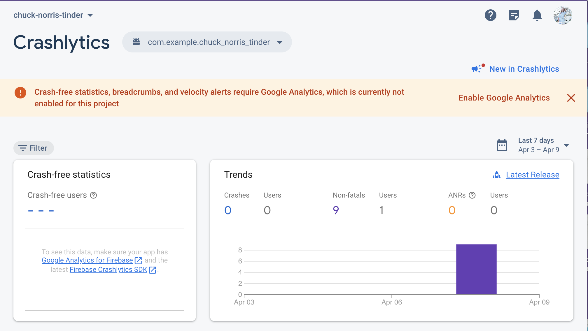
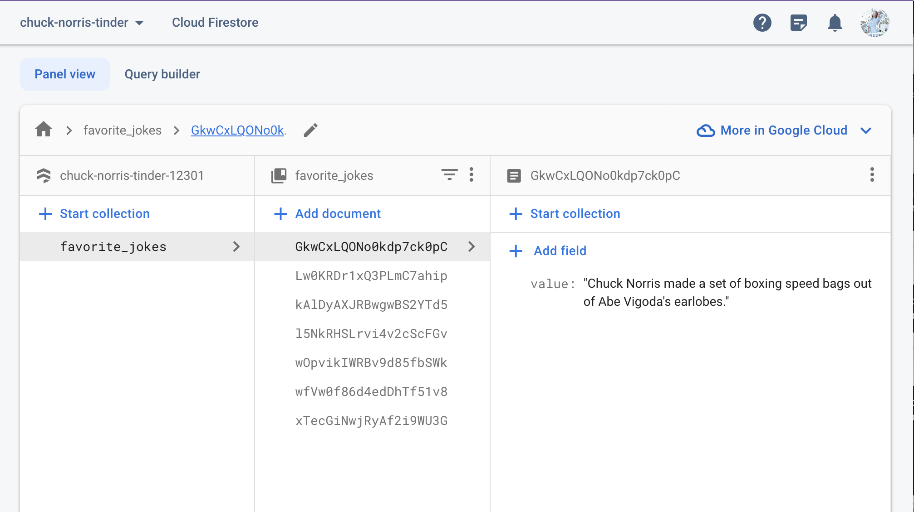
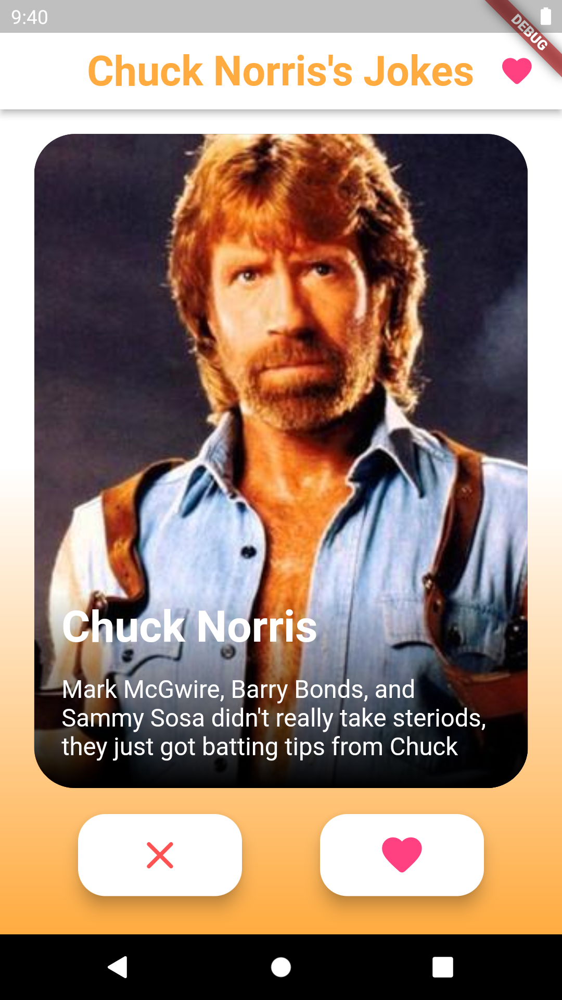
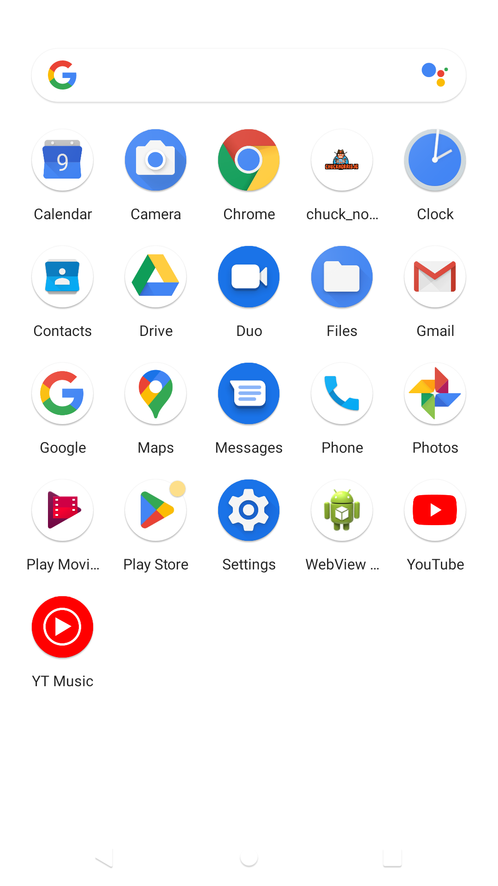

# chuck_norris_tinder

# Description

Tinder app with Chuck Noris jokes.

Swipe card and get Chuck's joke.

In my app you can see 4 different images of Chuck (it is get from assets). 
Moreover, I have DraggableCard (left and right swipes), buttons 'like' / 'dislike'.

Used riverpod.
Added Crashlytics.
You can see all your favorite jokes on a separate screen.
Handled the miss of the Internet connection.

# Bonuses
Swipes.
Different images.
Store favourites in Firebase.
Localisation.
Custom app icon.

# Screenshots

  
   
   
  

  
  

  
  

  
   
  

# [APK](https://github.com/AnnaDluzhinskaya/chuck_norris_tinder/blob/main/apk/app-release.apk)